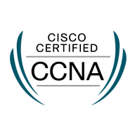

# Hi there, I'm [zhixuan](https://zhixuan.dev/).

## 💬 Worked skill for me

⁢⁣⁡Lang: GoLang, TypeScript / JavaScript, ⁢⁣⁡C / C++, Arduino, Docker, rust

MCU: esp32c6, esp32s3, stm32f4, nrf52, nrf54, ch32v003

## 📮 How to ping me

- Twitter [@zhixuan2333](https://twitter.com/zhixuan2333)
- Email [On github profile]()

## 🏆 Badges

<table>
  <tr>
    <td valign="top"></td>
    <td valign="top"></td>
  </tr>
</table>
